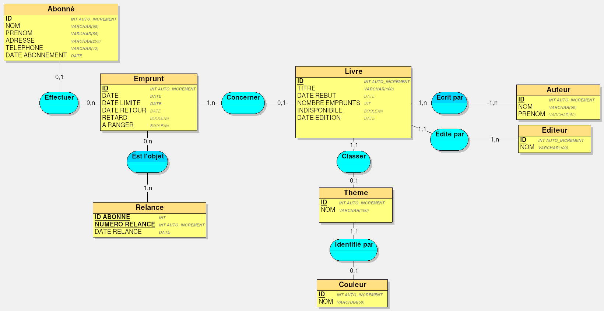

# Cas Bibliothèque

## Dictionnaire de données

### Abonné

| Donnée            | Nom           | Type         |
| ----------------- | ------------- | ------------ |
| Id                | abo_id        | counter      |
| Nom               | abo_nom       | varchar(50)  |
| Prénom            | abo_prenom    | varchar(50)  |
| Adresse           | abo_adresse   | varchar(255) |
| Téléphone         | abo_telephone | varchar(12)  |
| Date d'abonnement | abo_date      | date         |

### Livre

| Donnée                | Nom                | Type         |
| --------------------- | ------------------ | ------------ |
| Id                    | livre_id           | counter      |
| Titre                 | livre_titre        | varchar(100) |
| Auteur                | auteur_id          | int          |
| Editeur               | editeur_id         | int          |
| Thème                 | theme_id           | int          |
| Date d'édition        | livre_date_edition | date         |
| Date de mise au rebut | livre_date_rebut   | date         |
| Nombre d'emprunts     | livre_emprunts     | int          |
| Indisponibilité       | livre_indisponible | boolean      |

### Auteur

| Donnée | Nom           | Type        |
| ------ | ------------- | ----------- |
| Id     | auteur_id     | counter     |
| Nom    | auteur_nom    | varchar(50) |
| Prénom | prenom_auteur | varchar(50) |

### Editeur

| Donnée | Nom         | Type         |
| ------ | ----------- | ------------ |
| Id     | editeur_id  | counter      |
| Nom    | editeur_nom | varchar(100) |

### Thème

| Donnée  | Nom        | Type         |
| ------- | ---------- | ------------ |
| Id      | theme_id   | counter      |
| Nom     | theme_nom  | varchar(100) |
| Couleur | couleur_id | int          |

### Couleur

| Donnée | Nom         | Type        |
| ------ | ----------- | ----------- |
| Id     | couleur_id  | counter     |
| nom    | couleur_nom | varchar(50) |

### Emprunt

| Donnée          | Nom                 | Type    | Note                                                                                                                  |
| --------------- | ------------------- | ------- | --------------------------------------------------------------------------------------------------------------------- |
| Id de l'emprunt | emprunt_id          | counter |                                                                                                                       |
| Id de l'abonné  | abo_id              | int     |                                                                                                                       |
| Id  du livre    | livre_id            | int     |                                                                                                                       |
| Date d'emprunt  | emprunt_date        | date    |                                                                                                                       |
| Date limite     | emprunt_date_limite | date    | Date d'emprunt + 2 semaines.                                                                                          |
| Date de retour  | emprunt_date_retour | date    |                                                                                                                       |
| Retard          | emprunt_retard      | boolean | Vrai si la date d'emprunt  est  supérieure à la date limite et si la date de retour n'est pas renseignée, sinon faux. |
| A ranger        | emprunt_ranger      | boolean | Vrai si la date de retour est renseignée.                                                                             |

### Relance

| Donnée               | Nom          | Type    | Note       |
| -------------------- | ------------ | ------- | ---------- |
| Id de l'abonné       | abo_id       | int     |            |
| Numéro de la relance | relance_num  | counter | > 0 et < 4 |
| Date de la relance   | relance_date | date    |            |

## Modèle conceptuel de données

