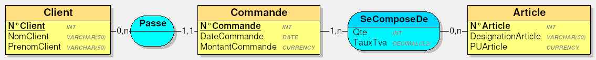

# Evaluation

## MCD


## Modèle physique

**Client**(<u>**N°Client**</u>, NomClient, PrenomClient)

**Commande**(<u>**N°Commande**</u>, DateCommande, MontantCommande, <u>**N°Client**</u>)

**SeComposeDe**(<u>**N°Commande**</u>, <u>**N°Article**</u>, Qte, TauxTva)

**Article**(<u>**N°Article**</u>, DesignationArticle, PUArticle)


## Explications

### Relations

* Pour la relation `Passe`, on inclut la clé primaire `N°Client` dans la table `Commande` en tant que clé étrangère.

* La relation `SeComposeDe` est transformée en table à laquelle on ajoute les clés étrangères `N°Commande` et `N°Article` qui formeront une clé primaire composée.


### Clés primaire / étrangères

* Afin de facilement retrouver un client, une commande ou un article, un numéro unique leur est attribué. `N°Client`, `N°Commande`  et `N°Article` sont donc choisi en tant que clés primaires pour leurs tables respectives.

* La table `SeCompose` contient une clé primaire composée des clés étrangères `N°Commande` et `N°Article` . Ainsi, un article ne figure qu'une seule fois par commande.

## Script de création de la base de données (MariaDB)

```sql
DROP DATABASE IF EXISTS Magasin;
CREATE DATABASE Magasin;
USE Magasin;

CREATE TABLE Client(
  N_Client INT,
  NomClient VARCHAR(50) NOT NULL,
  PrenomClient VARCHAR(50) NOT NULL,
  PRIMARY KEY(N_Client)
);

CREATE TABLE Commande(
  N_Commande INT,
  DateCommande DATE NOT NULL,
  MontantCommande DECIMAL(15,2) UNSIGNED NOT NULL,
  N_Client INT NOT NULL,
  PRIMARY KEY(N_Commande),
  FOREIGN KEY(N_Client) REFERENCES Client(N_Client)
);

CREATE TABLE Article(
  N_Article INT,
  DesignationArticle VARCHAR(50) NOT NULL,
  PUArticle DECIMAL(15,2) UNSIGNED NOT NULL,
  PRIMARY KEY(N_Article)
);

CREATE TABLE SeComposeDe(
  N_Commande INT,
  N_Article INT,
  Qte INT NOT NULL,
  TauxTva DECIMAL(3,2) NOT NULL,
  PRIMARY KEY(N_Commande, N_Article),
  FOREIGN KEY(N_Commande) REFERENCES Commande(N_Commande),
  FOREIGN KEY(N_Article) REFERENCES Article(N_Article)
);
```
